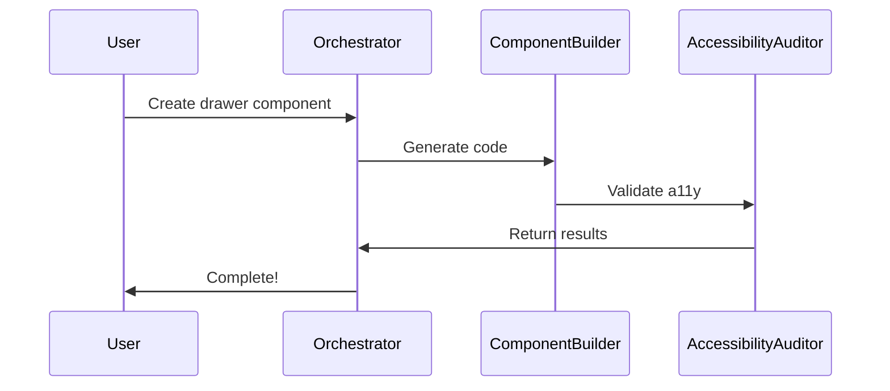

# Getting Started with Aural UI Agents

Welcome to the AI agent team for your Aural UI design system! This guide will walk you through your first workflow.

## ⚡ Quick Setup (5 minutes)

### 1. Get Your API Key

1. Go to https://console.anthropic.com/
2. Sign up or log in
3. Navigate to API Keys
4. Create a new key
5. Copy it (you'll need it in the next step)

### 2. Configure Environment

```bash
cd /Users/feraf/Projects/aural-ui/agents

# Create .env file
cp .env.example .env

# Open .env and add your API key
nano .env
```

Add this line to `.env`:
```
ANTHROPIC_API_KEY=your_actual_api_key_here
```

### 3. Verify Installation

```bash
# Check that dependencies are installed
npm list

# Should show @anthropic-ai/sdk and other packages
```

## 🚀 Your First Workflow

### Create a New Component

Let's create a simple component together:

```bash
npm run new-component
```

You'll be prompted with:

```
? Component name (e.g., drawer, data-table):
```

Try: `tooltip-enhanced`

```
? Component category:
```

Select: **Interactive**

```
? Describe the component (purpose, features, behavior):
```

Example:
```
A tooltip that appears on hover or focus with multiple positioning options (top, right, bottom, left). Supports rich HTML content and keyboard accessibility.
```

```
? List variants (comma-separated):
```

Try: `top, right, bottom, left, large, small`

```
? Does this component need JavaScript interactivity?
```

Select: **Yes**

### What Happens Next

The agents will work together:

1. **Orchestrator** plans the workflow
2. **Component Builder** generates CSS and JavaScript
3. **Accessibility Auditor** checks WCAG compliance
4. Files are saved to your design system

You'll see output like:

```
🤖 Orchestrator starting task: Plan workflow...
✅ Orchestrator completed task

🤖 Component Builder starting task: Generate component...
✅ Component Builder completed task

🤖 Accessibility Auditor starting task: Audit compliance...
✅ Accessibility Auditor completed task

✅ Component generation complete!

Generated files:
  - components/tooltip-enhanced.css
  - javascript/tooltip-enhanced.js
```

## 🧪 Try More Workflows

### Audit Accessibility

Check your existing components for WCAG compliance:

```bash
npm run audit-accessibility
```

Select a component or "Audit All Components" to get a comprehensive report.

**Output:** `accessibility-report.md` with scores and issues

### Interactive CLI

Launch the main CLI to see all available workflows:

```bash
npm run dev
```

This gives you a menu of all workflows:
- ✨ Create New Component
- ♿ Audit Accessibility
- 📚 Generate Documentation (coming soon)
- 🔧 Update Component (coming soon)
- 🧪 Generate Tests (coming soon)

## 📖 Understanding Agents

### Agent Roles

Each agent has a specific expertise:

**Orchestrator** 🎯
- Coordinates the workflow
- Breaks down complex tasks
- Ensures quality gates pass

**Component Builder** 🏗️
- Generates CSS and JavaScript code
- Follows design system rules
- Implements all variants and states

**Accessibility Auditor** ♿
- Checks WCAG 2.1 AA compliance
- Validates keyboard navigation
- Ensures proper ARIA attributes

**Design Architect** 🎨 (coming soon)
- Validates token usage
- Ensures design consistency
- Reviews component architecture

**Documentation Writer** 📚 (coming soon)
- Generates component docs
- Creates usage examples
- Maintains API reference

**Testing Engineer** 🧪 (coming soon)
- Creates test cases
- Validates functionality
- Runs visual regression tests

**QA Agent** ✅ (coming soon)
- Final quality review
- Standards enforcement
- Bundle size validation

### How Agents Work Together



1. You make a request
2. Orchestrator analyzes and plans
3. Specialized agents execute tasks
4. Results are validated
5. You get production-ready code

## 🎯 Example Use Cases

### 1. Build a Complex Component

**Scenario:** You need a data table with sorting, filtering, and pagination.

```bash
npm run new-component
```

**Input:**
- Name: `data-table-advanced`
- Type: Data Display
- Description: "Full-featured data table with column sorting, search filter, pagination, row selection, and responsive mobile layout"
- Variants: `striped, bordered, compact, hoverable`
- Interactive: Yes

**Result:** Production-ready component with:
- ✅ Complete CSS with all variants
- ✅ JavaScript for interactivity
- ✅ Keyboard navigation
- ✅ ARIA attributes
- ✅ Mobile responsive
- ✅ Accessibility validated

### 2. Audit Your Design System

**Scenario:** You want to ensure all 61 components are accessible.

```bash
npm run audit-accessibility
```

Select: **Audit All Components**

**Result:**
- Accessibility scores for each component
- List of issues with severity
- Specific fixes with code examples
- Detailed report saved to `accessibility-report.md`

### 3. Maintain Consistency

**Scenario:** A designer asks "Does our card component support all the color variants?"

**Solution:** Agents ensure consistency:
- All components use semantic tokens
- Consistent variant naming
- Standardized state handling
- Documented patterns

## 🔧 Customization

### Modify Design System Rules

Edit `src/config/design-system-rules.ts` to customize:

```typescript
export const DESIGN_SYSTEM_RULES = {
  tokens: {
    rules: [
      'All components MUST use semantic tokens',
      // Add your custom rules
    ],
  },
  // ... customize everything
};
```

### Adjust Agent Behavior

Edit `src/config/agent-config.ts` to change:

```typescript
export const AGENT_CONFIGS = {
  componentBuilder: {
    temperature: 0.4,  // Lower = more consistent
    maxTokens: 8192,   // Adjust output length
    // ... customize prompts
  },
};
```

## 💡 Tips for Success

### 1. Be Specific in Requirements

**Good:**
```
Create a modal component with:
- Overlay that dims background
- Center positioning
- Close button in top-right
- Escape key closes modal
- Focus trap while open
- Smooth fade-in animation
```

**Less Good:**
```
Create a modal
```

### 2. Review Generated Code

Agents are smart assistants, not replacements:
- ✅ Review all generated code
- ✅ Test in your browser
- ✅ Adjust as needed
- ✅ Learn from the patterns

### 3. Iterate with Agents

Use the conversation history:
```bash
# First run generates component
npm run new-component

# Review output, then refine
npm run update-component
```

### 4. Validate Accessibility

Agents check programmatically, but always:
- Test with keyboard only
- Use a screen reader
- Check color contrast manually
- Test on real devices

### 5. Keep Design System Rules Updated

As your design system evolves:
- Update `design-system-rules.ts`
- Agents will follow new patterns
- Maintains consistency

## 🐛 Troubleshooting

### API Key Not Found

```
❌ Error: ANTHROPIC_API_KEY not found
```

**Solution:**
1. Check `.env` file exists
2. Verify API key is correct
3. No quotes around the key
4. Restart terminal if needed

### Import Errors

```
Cannot find module '@anthropic-ai/sdk'
```

**Solution:**
```bash
npm install
```

### TypeScript Errors

```
Type error in src/...
```

**Solution:**
```bash
npm run build
```

Check for any type mismatches in the code.

### Agent Timeout

If an agent takes too long:

1. Check your internet connection
2. Verify API key is valid
3. Try reducing `maxTokens` in config
4. Break task into smaller steps

## 📚 Next Steps

Now that you've set up the agent system:

1. ✅ Create your first component
2. ✅ Run an accessibility audit
3. ✅ Review the generated code
4. ✅ Customize design system rules
5. ✅ Add new agents as needed

## 🎓 Learning Resources

- **Claude API Docs:** https://docs.anthropic.com/
- **Aural UI Docs:** /Users/feraf/Projects/aural-ui/README.md
- **Design System Rules:** `src/config/design-system-rules.ts`
- **Agent Examples:** `src/agents/`
- **Workflow Examples:** `src/workflows/`

## 🤝 Get Help

Questions or issues?

1. Check this guide first
2. Review `README.md`
3. Check agent configurations
4. Review generated code for patterns

## 🎉 You're Ready!

Your AI agent team is set up and ready to help you build enterprise-grade components.

**Start with:**

```bash
npm run new-component
```

**Have fun building! 🚀**
